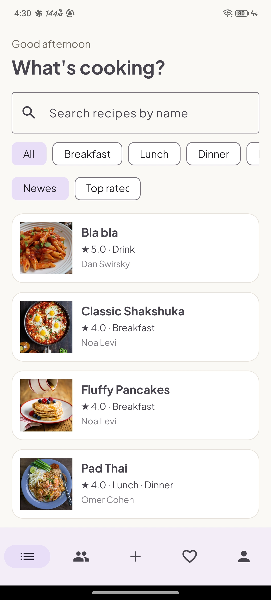
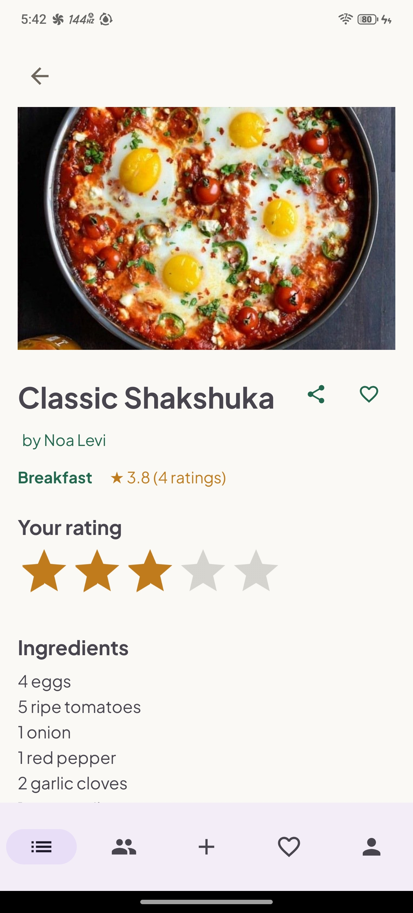
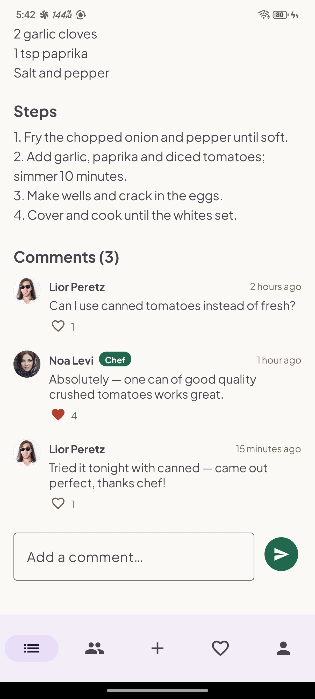
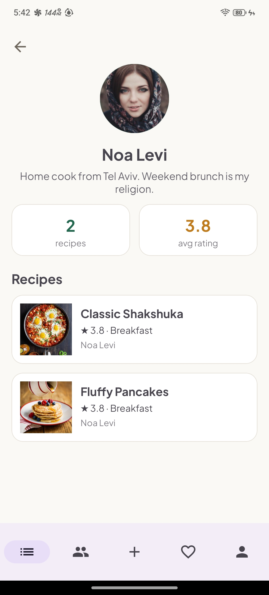
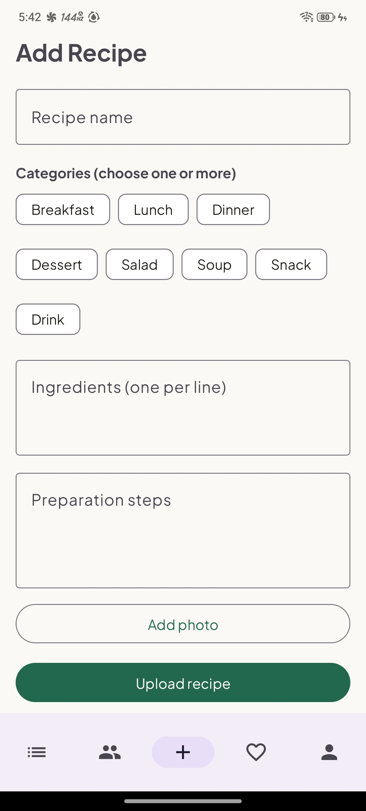

# MyEats 🍳

**Cook it. Share it. Rate it.**

Final project for UI/UX Development (26B 10208) — Dan Swirsky.

A community cookbook app for Android: upload recipes with photos, browse everyone's dishes in a live feed, find cooks, save favorites and rate recipes.

## 🎥 Demo video

> **[Watch the demo video](ADD_VIDEO_LINK_HERE)** — walkthrough of every screen and feature.

## 📱 Screenshots

| Feed | Recipe | Comments |
|---|---|---|
|  |  |  |

| Cook profile | Add recipe |
|---|---|
|  |  |

## Tech

Android · Kotlin · MVVM · Firebase (Auth + Realtime Database + Storage) · Material Design 3 · Navigation Component · Glide

## Features

- **Auth** — email/password registration and login with validation; session persists across launches; **email verification** required for new accounts (Firebase link + resend); login failures show one generic message so the app never reveals whether an account exists (anti-enumeration). Demo `@myeats.com` accounts bypass verification. Password reset ("Forgot password?") is available from the login screen.
- **Live feed** — real-time first page + infinite scroll (cursor pagination); nothing beyond the visible pages is ever downloaded
- **Server-side search** — indexed prefix search on recipe titles and cook names, plus ingredient search backed by a denormalized keyword index (typing "sugar" finds every recipe that uses sugar); works at any database size
- **Sorting** — Newest / Top rated chips; the preference is remembered on the device (SharedPreferences)
- **Recipe page** — photo, multi-categories, live average rating, 1-5 star rating (transactional, one per user), favorite with haptic feedback, share via the Android share sheet (implicit intent)
- **Comments** — live comment thread on every recipe; the recipe owner's replies carry a green **Chef** badge; authors can edit (with an "edited" label) and delete their own comments; every comment can be liked (one like per user, live counter)
- **Upload / edit / delete** — photo from the gallery (Photo Picker) with automatic background JPEG compression; owner-only edit and delete
- **Cooks tab** — browse and search cooks, open a classic profile page (photo, bio, stats, recipe list)
- **Favorites tab** — targeted per-id loading, multi-select removal
- **My Page** — profile photo + bio editing, stats, my recipes
- **Polish** — animated splash, custom fonts (Darker Grotesque + Plus Jakarta Sans), warm light design, empty/loading/error states, rotation-safe everywhere

## Architecture

```
app/src/main/java/com/danswirsky/myeats/
├── App.kt              custom Application — initializes app-wide singletons
├── data/
│   ├── model/          Recipe, User
│   └── repository/     AuthRepository, RecipeRepository, UserRepository
├── ui/
│   ├── splash/         SplashActivity (animated entry + routing)
│   ├── auth/           AuthActivity, Login/Register + AuthViewModel
│   ├── feed/           FeedFragment, FeedViewModel (pagination + search), RecipeAdapter
│   ├── details/        RecipeDetailsFragment + DetailsViewModel + CommentAdapter
│   ├── add/            AddRecipeFragment + ViewModel (add + edit modes)
│   ├── cooks/          CooksFragment, CooksViewModel, CookAdapter
│   ├── user/           UserRecipesFragment + ViewModel (cook profile page)
│   ├── favorites/      FavoritesFragment + FavoritesViewModel
│   └── profile/        ProfileFragment, EditProfileFragment + ViewModels
└── util/               ImageUtils, KeyboardUtils, SharedPreferencesManager, SignalManager
```

MVVM: the UI never talks to Firebase directly — everything goes through the repositories. ViewModels + LiveData keep all state across rotation (including chip selections, picked images and multi-select state).

### Built to scale

No screen ever downloads a whole database node:

- **Feed** — live first page (30 items) + cursor pagination on scroll (`orderByChild(createdAt/ratingAvg).endBefore(...).limitToLast(30)`)
- **Search** — indexed server-side prefix queries on `titleLower` / `nameLower`
- **Top rated** — sorted by a denormalized `ratingAvg` field, updated inside the rating transaction
- **Cook pages / My recipes** — indexed `orderByChild("ownerUid").equalTo(uid)` queries
- **Favorites** — fetched per saved id
- **Recipe counters** — denormalized `recipeCount` on the user, updated on upload/delete

## Setup (required before first build)

1. Open the project in Android Studio.
2. In the [Firebase Console](https://console.firebase.google.com):
   - Create a project and add an Android app with package name `com.danswirsky.myeats`.
   - Download **`google-services.json`** into the **`app/`** folder.
   - Enable **Authentication → Email/Password**.
   - Create a **Realtime Database** and enable **Storage**.
   - **Realtime Database → Rules**: paste `firebase/database.rules.json` (includes the required query indexes).
   - **Storage → Rules**: paste `firebase/storage.rules`.
3. Sync Gradle and run.

`google-services.json` is intentionally in `.gitignore`.

### Demo data

`python3 firebase/seed_all.py` creates 15 demo users (profile photos + bios), 33 recipes with real food photos (including a cocktail from TheCocktailDB), cross-ratings, and 12 comment threads with Chef replies and likes. Demo credentials are written to `firebase/seed_users_credentials.txt` (git-ignored). Password for all demo users: `123456`.

## Data model (Realtime Database)

```
users/{uid}:      { uid, name, nameLower, email, photoUrl, bio, recipeCount,
                    favorites: { recipeId: true } }
recipes/{id}:     { id, title, titleLower, ingredientKeywords: { word: true },
                    ownerUid, ownerName, categories[], ingredients, steps,
                    imageUrl, createdAt, ratings: { uid: stars },
                    ratingSum, ratingCount, ratingAvg }
comments/{recipeId}/{commentId}:
                  { id, recipeId, authorUid, authorName, authorPhotoUrl,
                    text, createdAt, edited, likes: { uid: true } }
```

Photos live in Storage under `recipe_images/{recipeId}.jpg` and `profile_images/{uid}.jpg` (compressed to ≤ ~300 KB before upload).

## Libraries

| Library | Used for |
|---|---|
| Firebase Auth / Realtime Database / Storage | Accounts, live data, photos |
| Navigation Component | Fragment navigation + bottom nav |
| Lifecycle (ViewModel + LiveData) | State that survives rotation |
| Glide | Image loading + caching |
| Material Components (M3) | Design system |

## Known limitations

- Search matches by prefix of the recipe/cook name (Realtime Database has no full-text search; a production app would add a search service like Algolia).
- Recipe images are compressed on-device to keep uploads small; very large originals may lose some detail.
